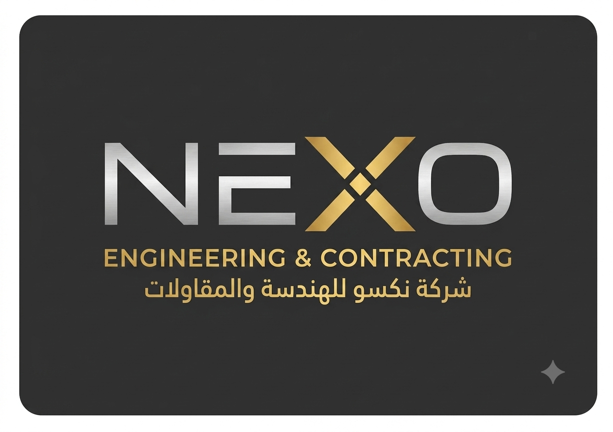

<div align="center">
  
  <h1>NEXO — Next-Generation Engineering eXcellence Organization</h1>
  <p><strong>شركة نكسو للهندسة والمقاولات</strong><br>Engineering, contracting, and technical training — Baghdad, Iraq</p>
</div>

---

The official single-page website for NEXO Engineering & Contracting. It is a static site with no build step: one HTML file with inline CSS, plus an images folder.

## Running locally

Open `index.html` in a browser, or serve the project root so relative asset paths resolve exactly as they do in production:

```bash
python3 -m http.server 8000
# then visit http://localhost:8000
```

## Project structure

```
index.html          # entire page — inline CSS, markup, and the mobile-nav script
assets/images/      # all imagery
CLAUDE.md           # notes for AI coding assistants
```

## Page sections

| Anchor | Section |
| --- | --- |
| — | Hero |
| `#about` | About NEXO |
| `#services` | Core operational divisions |
| `#portfolio` | Clients & industry partners |
| `#academy` | Training & capacity academy |
| `#contact` | Contact form and details |

## Divisions

- **Architectural & Structural Design** — spatial planning, 3D visualization, structural calculations, BIM modeling, facade and interior engineering.
- **General Contracting & Construction** — high-rise structures, petroleum and industrial infrastructure, MEP integration, structural rehabilitation.
- **Training & Capacity Academy** — Revit, ETABS, AutoCAD, Primavera P6, site supervision and HSE, concrete testing, certification masterclasses.

## Editing guide

**Colors and styling.** The theme is driven entirely by CSS custom properties on `:root` at the top of the `<style>` block — the matte charcoal, silver, and gold palette (`--gold-primary: #D4AF37`), shadows, and the shared transition easing. Change values there rather than at individual call sites. Layout responds at two breakpoints: 992px and 768px.

**Images.** Add files to `assets/images/` using kebab-case names with an extension that matches the real file format. Every `` includes an inline `onerror` fallback to a remote stand-in so the page never shows a broken image; follow that pattern for anything new.

**Bilingual content.** Company and partner names carry their Arabic form in the `alt` attribute. Keep both when editing.

## Pending work

- Two images are referenced but not yet supplied — `assets/images/hero-facade.png` and `assets/images/operations-collage.png`. Both currently fall back to stock photography.
- The division cards link to `architectural-design.html`, `general-contracting.html`, and `training-academy.html`, which have not been built yet.
- The contact form is front-end only: it shows a confirmation dialog and does not submit anywhere.
- The contact phone number is still a placeholder.

## License

© 2026 NEXO Engineering & Contracting Co. All rights reserved.
