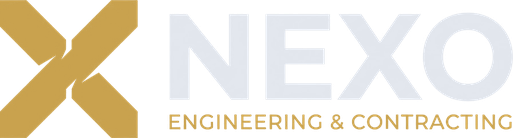

<div align="center">
  
  <h1>NEXO Engineering &amp; Contracting</h1>
  <p><strong>شركة نكسو للهندسة والمقاولات</strong><br>Engineering, contracting, and technical training — Baghdad, Iraq</p>
</div>

---

The official website for NEXO Engineering & Contracting: a bilingual static site with
no build step, no package manager, and no test suite. Two HTML files plus `assets/`
are the entire deliverable.

## Running locally

Serve the project root — this is the only mode that matches production, because the
root-absolute references (`/favicon.ico`, `/site.webmanifest`, `/assets/icons/`) and
the clean `/ar/` URL do not resolve over `file://`.

```bash
python3 -m http.server 8000
# http://localhost:8000/     English
# http://localhost:8000/ar/  Arabic
```

## Project structure

```
index.html          # English (LTR): inline CSS, markup, script, JSON-LD
ar/index.html       # Arabic (RTL): same structure, own stylesheet
content.en.md       # every English string, in page order — copy source of truth
content.ar.md       # every Arabic string, in page order — copy source of truth
design.md           # Digital Identity Guidelines v2.0 — the brand authority
assets/brand/       # the mark and the two lockups (generated)
assets/fonts/       # self-hosted WOFF2 (generated)
assets/images/      # photography and partner logos
assets/icons/       # favicons and PWA icons (generated)
brand-source/       # approved masters the generated assets are built from
tools/              # the brand asset generator
CLAUDE.md           # notes for AI coding assistants
```

Neither page imports the other's CSS; each carries a complete `<style>` block, so
**a change to shared structure has to be made twice**. That duplication is the
deliberate cost of having no build step.

## Editing

**Copy** is not authored in the HTML. Edit `content.en.md` / `content.ar.md` first,
then mirror the change into the markup by hand. Those files also record the
per-language copy rules.

**Colour and type** flow through CSS custom properties on `:root` at the top of each
`<style>` block — `--ink`, `--gold` (`#C9A24E`), `--rule`, `--silver`, and the three
font roles. Change values there rather than at call sites. Only two breakpoints
exist: 992px and 768px. `design.md` is the authority for every value; where it
conflicts with the code, the document wins.

**Images** go in `assets/images/` with kebab-case names and an extension matching the
real format. Every `` carries an inline `onerror` fallback chain so the page
never shows a broken image — follow that pattern for anything new, and set both
`width` and `height` to the file's real pixel dimensions.

**Bilingual `alt` text.** Company and partner names carry the other language's form
in the `alt` attribute — Latin first on the English page, Arabic first on the Arabic
one. Keep both when editing.

## Regenerating the brand assets

Every icon, favicon, lockup, and the social card is generated from the masters in
`brand-source/`. Do not edit them by hand — change the master and re-run:

```bash
python3 tools/build-brand-assets.py   # requires Pillow
```

The webfonts are self-hosted for the same reason — served from Google, the Arabic
page rendered unstyled for seconds on first load. Re-fetch them with:

```bash
python3 tools/fetch-fonts.py          # writes assets/fonts/ + prints the @font-face CSS
```

Do not reintroduce the Google Fonts `<link>`: it is render-blocking, on a
third-party origin, and puts two connection setups in series ahead of the first
font byte.

That rewrites `assets/brand/nexo-symbol.svg`, both lockups, the four PWA icons,
`favicon.ico`, and `assets/images/og-cover.png`. The script is the single source of
truth for all of them; the previous identity's generator was not kept, which is why
its icons had to be rebuilt by hand.

## Pending work

- Two photographs are referenced but not yet supplied — `assets/images/hero-facade.jpg`
  (masked into the hero mark) and `assets/images/about-site.jpg` (Fig. 02). Both fall
  back to stock photography until the real files are dropped in at those paths.
- The three divisions expand inline as accordions; there are no per-division pages.
- `#contact` lists the office details and an email link. There is no contact form —
  the previous one had no backend and collected nothing.

## License

© 2026 NEXO Engineering & Contracting Co. All rights reserved.
